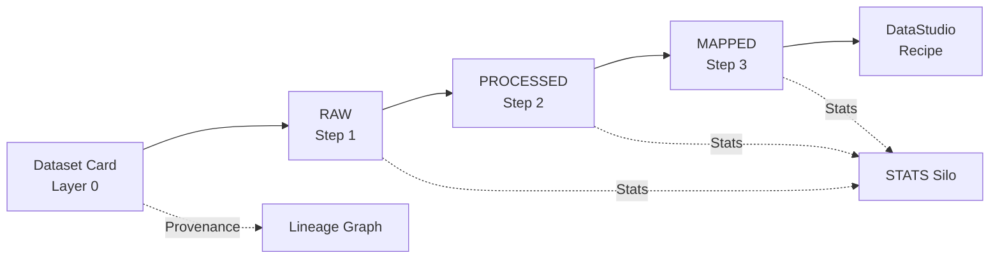

# 1. Introduction

This dashboard has been designed to support the entire lifecycle of enterprise dataset management, preprocessing, and querying.

**Core objectives:**

- Register metadata, preprocess, and query Distributions stored in a specific FileSystem path.
- Create custom training Recipes by partitioning, selecting, and merging existing datasets.
- Manage dataset creation recipes with full metadata tracking and provenance.

**Technology stack:** Streamlit (frontend), PostgreSQL (Metadata DB), DuckDB (analytics engine), Docker (deployment).

---

## High-Level Pipeline

---

## Dataset Card Management (Layer 0)

In this section you can manage dataset cards through:

- Inserting / registering new dataset cards.
- Editing existing dataset cards.
- Deleting dataset cards.
- Downloading / materializing dataset cards (HuggingFace sources only).

---

## Dataset / Distribution Workflow (Layer 1-2-3)

In this section you can **navigate the FileSystem** until you reach a leaf directory containing the desired distribution files.

Each layer follows a structure based on its dataset format, and is persisted in a specific partition of the underlying file system.

1. **RAW LAYER**: Downloaded data, original format and contents.
2. **PROCESSED LAYER**: Data transformed into the enterprise standard `jsonl.gz` format, enriched with core metadata fields appended to each record (`_id_hash`, `_lang`, `_subpath`, `_dataset_name`, `_dataset_path`, `_filename`) derived from processing the RAW data.
3. **MAPPED LAYER**: Data modified at the structural level, mapped from a source schema to the enterprise conversational schema templates.

Depending on the level of metadata knowledge available for the dataset, the system progressively unlocks different functionalities:

1. **No associated metadata** -- only metadata editing is available.
2. **Metadata present, but no `src_schema`** -- you can proceed with `src_schema` extraction.
3. **`src_schema` available** -- you can create a `mapping` between the source schema and the enterprise template.
4. **Mapping correctly defined** -- it becomes possible to **load the dataset in standard format**, saved in a dedicated area of the FileSystem.
5. Once loaded, the dataset can be queried via **Dashboard SQL** for advanced selections and projections.
6. In some layers, queries include the option of advanced filters based on statistics and counts computed during processing phases.

---

## DataStudio

The *DataStudio* section provides advanced tools for exploring and creating recipe datasets.

**Operational workflow:**

1. **Distribution selection** -- choose distributions (paths) from a result list and add them to a `bag`.
2. **Sampling rules** -- define sampling rules for each selected distribution.
3. **Load in append mode** -- merge selected data into a data contract.

---

## System Prompt Management

Centralized management of system prompts used by agents and models.

Key features:

- Creation, editing, and deletion of prompts.
- Full-text search and language filters.
- Advanced filter on length range (min/max) with dynamic maximum computed from the prompt table.
- Preview and versioning of saved prompts.

---

## Schema Template Management

Management of enterprise schema templates used for mapping incoming data.

Key features:

- Creation and saving of JSON templates with version and metadata.
- JSON editing and validation, preview of the saved schema.
- Listing and searching templates with detail views and safe deletion.

---

## Provenance Layer

In this section you can get a high-level view of the dependencies across the following structures:

1. Provenance across Cards, Datasets, and Distributions between layers.
2. Provenance of data recipe derivations.
3. System prompt derivation tree.
