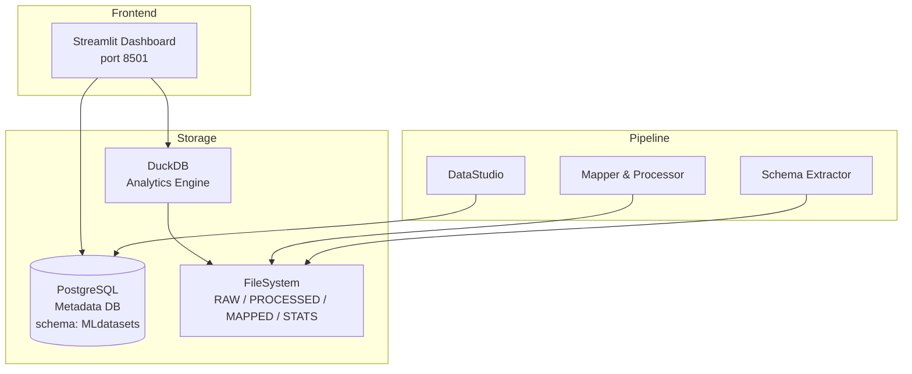

# 2. System Architecture: SFT Data Forge

Overview of the general architecture of the dashboard and its main components for managing the dataset lifecycle.

---

## Overview

SFT Data Forge is an advanced system for managing datasets across their various lifecycle stages. The architecture is based on a clear separation between the logical representation (**Dataset Card**) and the physical implementation of the data, structured across three distinct layers. The system also integrates a **provenance** layer to track dependencies and derivations between datasets, recipes, and system prompts (including versioning and optimizations), ensuring superior data governance.

---

## FileSystem Layers

The system uses **four** physically separate silos on disk to ensure data integrity and transformation traceability: three for the main layers (RAW, PROCESSED, MAPPED) and one dedicated to **statistics** (STATS).

### RAW Layer
Contains raw data as acquired from the original sources. This is the entry point for data into the system, preserved in its native form to allow future reprocessing.

### PROCESSED Layer
At this level, data undergoes initial cleaning and standardization. Transformations are applied to normalize the structure or safely distill the content. Each record is enriched with core metadata fields (`_id_hash`, `_lang`, `_subpath`, `_dataset_name`, `_dataset_path`, `_filename`).

### MAPPED Layer
Represents the final stage of the data, ready for consumption or integration. Data is mapped according to the definitive target schema template, ready to be used in training or analysis phases.

### STATS Silo
A dedicated silo that mirrors the path structure of the three main layers. It stores pre-computed statistics in Parquet format (e.g., `low_level_stats`, `chat_template_stats`). This mirroring allows the Dashboard SQL to automatically join statistics tables with source data for enriched querying.

---

## Data Flow

Data flows linearly through the physical layers, governed by the **Metadata DB** (PostgreSQL):

1. **Ingestion**: Acquisition into the RAW layer.
2. **Metadatation**: Creation of the descriptor for each Dataset/Distribution entity.
3. **Transformation**: Movement between layers via controlled pipelines or manual scripts.
4. **Tracking**: The Provenance layer records every derivation between datasets and the related recipes/prompts used.

---

## Main Components

### Backend (Modules and Pipelines)
Under the hood, the application exposes various modules that enforce a controlled standard. In addition to automated workflows, SFT Data Forge provides reusable packages for manual interventions via custom scripts:

* **Mapper**: For managing mappings between schemas.
* **Processing Pipelines**: Engines for data transformation (built on `datatrove`).
* **Statistics & Counts**: Modules for automatic metric extraction.
* **Schema Extractor**: Tool for identifying the source schema (using `genson`).

### Frontend / Dashboard (Logical Layer)
The user access point is the **Streamlit Dashboard**, which exposes the Dataset Card as a logical cloud overseeing the physical layers. From here, users can curate all metadata.

### Storage
Storage is hybrid:

* **FileSystem**: Physical storage of data in the four silos (RAW, PROCESSED, MAPPED, STATS).
* **Metadata DB (PostgreSQL)**: Database that physically points to each entity on disk, maintaining coherence between application logic and actual files. Uses the `MLdatasets` schema with controlled vocabularies, triggers for auto-versioning, step detection, and ontological validation.

---

## System Prompt & Schema Template

- To map data to a destination schema, SFT Data Forge allows the user to define a **Schema Template** in JSON format. This template represents the target structure to which data must conform. A mapping M is then defined that transforms a Dataset D with source schema S into a new derived dataset that adheres to the destination schema T defined by the user.

- SFT Data Forge treats **System Prompts** as recipe metadata. When a dataset is included in a data contract (recipe) alongside other datasets, the user can associate one or more system prompts to each distribution entry. This association is tracked via an N:N relationship table (`strategy_system_prompt`).

---

## Manual Intervention Procedures

In some cases, an advanced user requires additional or specific tools for analysis and processing (e.g., computing new information with custom algorithms/models). This may require the user to operate outside the controlled environment.

An advanced user must modify data with a specific script and subsequently rejoin the resulting datasets with the Metadata DB. This introduces specific constraints and advanced-user procedures, which are covered in Chapter 10.

The application supports (via UI or direct DB insert) the insertion of entities with informational fields to track actions taken by the user that led to the creation of a new derived dataset.

---

## Technology Stack

| Component | Technology | Notes |
|-----------|-----------|-------|
| Frontend | Streamlit | Exposed on port 8501 |
| Metadata DB | PostgreSQL | Schema `MLdatasets`, with pgcrypto and uuid-ossp extensions |
| Analytics Engine | DuckDB | For SQL dashboard queries on distribution data |
| Deployment | Docker + docker-compose | Dev and prod configurations available |
| Data Pipelines | datatrove | For processing, mapping, and statistics computation |

---

## Dependencies and Prerequisites

* **PostgreSQL Database**: For the persistence of metadata and provenance graphs.
* **File System Access**: Read/write permissions on the directories dedicated to the four physical silos.
* **Docker**: For containerized deployment (optional for local development).
