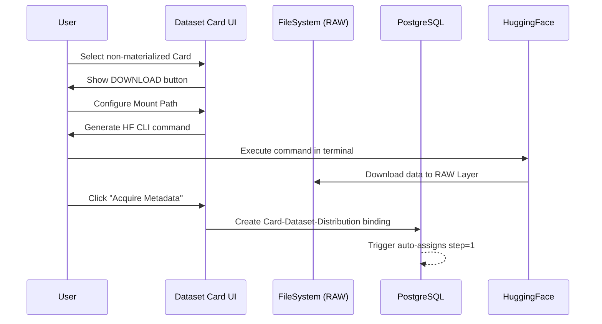

# 4. HuggingFace Dataset Download

Functionality for downloading from HF and materializing datasets from the source to the local FileSystem (RAW Layer).

---

## Overview

This section describes the operational workflow for bringing a **Dataset Card** from a logical entity ("Candidate" or non-materialized) to a physical entity present on disk. SFT Data Forge automates the download configuration, ensuring that data is correctly allocated within the layered file system structure.

---

## Download from HuggingFace

The download process is guided and is activated directly from the **Search Dataset Cards** section. Once you have identified and opened the card of interest that points to an HF repository, follow these steps:

1. **Trigger**: Click the **"DOWNLOAD DATASET"** button at the bottom of the dataset card.
2. **Mount Path Configuration**: The user must specify the complete path where the dataset will be mounted. This can be done via:
    * Guided folder navigation. [Recommended]
    * Copy-paste of the text path. [Not recommended]
3. **Mount Warning**: The dataset mount must be the folder with the dataset name. It must not reference (although supported) branches by language, context, phase, or split, which will determine the subfolder structure.
    * Correct example: `RAW_PATH/{dataset_name}`
    * Incorrect example: `RAW_PATH/{dataset_name}/{lang_code/train/long_context...}`
4. **Command Generation**: After confirming the path (and optionally creating the directory), a button will appear to generate the **HF CLI** command.
5. **External Execution**: Copy the generated command and execute it in the host machine's terminal to start the physical data transfer.

---

## Metadata Acquisition and Binding

Once the physical download via terminal is complete, it is essential to close the logical cycle in the system:

* Return to the Dataset Card screen.
* Click the **"Acquire Metadata"** button.
* This operation creates the definitive **binding (link)** between the logical card and the newly downloaded RAW dataset, making it available for the processing pipelines.

---

## Automatic Step Assignment

When the binding is created, a database trigger (`fn_update_step_from_uri`) automatically detects the step value from the dataset URI by matching it against the configured path prefixes in the `config_paths` table. For datasets downloaded to the RAW layer path, the step is automatically set to 1 (RAW).

---

## Download Status

Download status can be checked via the HF `logs/` folder, which will be mounted starting from the dataset mount directory.

---

## Output on the FileSystem

Downloaded files are organized in the **RAW Layer** following the hierarchy defined during the wizard:

* `[Mount_Path as Dataset_Name]/[Distribution_description]/*`

This structure ensures that each "branch" of the dataset is isolated and ready to be processed by the Mapper or Statistics modules of SFT Data Forge.

Ideally, each distribution is a leaf folder containing only files. If that is not the case, the system considers only the leaf folders it finds starting from the dataset mount point.

---

## Error Handling

* **Invalid path**: If the mount directory is not writable or the path is incorrect, the wizard will report the error before generating the CLI command.
* **Missing binding**: If "Acquire Metadata" is not clicked after the download, the system will continue to see the dataset as non-materialized, preventing automatic transformations.
* **CLI interruption**: In case of error during terminal command execution, verify the connection to HuggingFace and disk space availability. Errors will be present in the HF logs.
