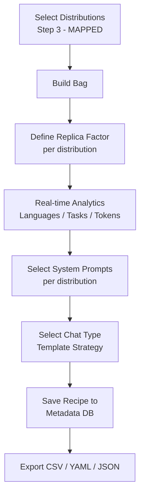

# 7. DataStudio -- Training Recipes

Creation of recipe datasets through selection, sampling, and merging of existing distributions to ensure visibility, traceability, and replicability of training.

---

## What is a Recipe

A **Recipe** is a data contract that defines the final assembly of multiple distributions. The purpose is to create a dataset ready for ML model training, where every choice (sampling, template techniques, and prompts used) is recorded to allow perfect replicability of the resulting dataset. The output is a coherent and standardized entity, exportable in various formats.

---

## Distribution Selection

The workflow begins in the **Selection** section, where the user composes their data "bag":

* **Search & Filter**: Through the search bar and advanced filters, you can identify candidate distributions for the recipe.
* **Bag Composition**: Each selected distribution is added to the bag, becoming an "item" of the final recipe.

> **IMPORTANT:** Only distributions with **Step 3 (MAPPED)** can be selected for a recipe. This constraint is enforced at the database level via a trigger that prevents non-MAPPED distributions from being included in any recipe strategy.

---

## Sampling Rules (Replica Factor Selection)

Once the bag is composed, sampling rules must be defined to balance the dataset:

* **Replica Factor**: For each distribution, a replica factor must be specified.
* **Real-time Analysis**: With each change to the factor, the system dynamically updates a dashboard showing:
    * Language and task distribution.
    * Total count of samples, words, and tokens.
    * Global and granular aggregate statistics per dataset/distribution.
* **Downsampling & Replicability**: If a non-integer Replica Factor is specified (e.g., 0.5), the distribution is first materialized as a downsampled file (with RF = 1), so that the final recipe file contains only integer factors per row. This ensures deterministic replicability.

---

## Prompt and Chat Strategy Configuration

Before consolidation, the interaction parameters are defined:

1. **System Prompt Selection**: For each distribution, the user selects one or more system prompts. If the field is left empty, the system uses the prompt already present in the distribution or applies a default one.
2. **Chat Type**: The data preprocessing strategy is selected. This parameter identifies the specific **chat_template** that will be used to format the data before feeding it to the model.

> **NOTE:** The relationship between strategy and system prompt is N:N: a strategy can have multiple associated prompts, and the same prompt can be reused across multiple strategies. This is tracked via the `strategy_system_prompt` table.

---

## Load in Append Mode and Export

Once the desired configuration is defined, the recipe is consolidated:

* **Save**: The complete configuration is saved in the Metadata DB.
* **Export Formats**: The recipe is immediately downloadable in **CSV**, **YAML**, and **JSON** formats.

---

## Recipe Metadata Tracking

SFT Data Forge automatically records every detail for **Provenance**:

* **Input**: IDs of the original distributions.
* **Transformations**: Applied replica factors and downsampling parameters.
* **Prompting**: Associated system prompts.
* **Template**: Chat type related to the preprocessing strategy.
* **Stats**: Number of tokens, words, and samples for each row.

---

## Checkpoints and Results

After training with a recipe, the system allows registering **checkpoints** with their associated results and hyperparameters:

* Each checkpoint is linked to a recipe and has a unique progressive number.
* **Results** are stored as JSONB, allowing flexible storage of evaluation metrics (e.g., accuracy, loss, perplexity).
* **Hyperparameters** are also stored as JSONB, capturing the training configuration used.
* A source URI (`src_uri`) tracks where the checkpoint artifacts are physically stored.

This enables full reproducibility tracking: from the data recipe composition through training configuration to final model performance.
