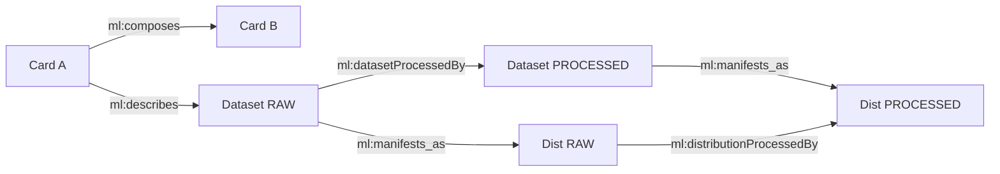

# 8. ML Lineage & Provenance Explorer

The Provenance system of SFT Data Forge allows you to reconstruct the entire "history" of a piece of data or a configuration, graphically visualizing the dependencies, parent/child versions, and derivations between datasets, recipes, and prompts.

---

## Dataset Lineage (ML Lineage)

This explorer allows you to navigate the relationships between the core entities of the system through a BFS (Breadth-First Search) with configurable depth (up to 25 hops).

### Node Categories

The data lineage supports three levels of abstraction:

* **Card**: The top logical level that aggregates metadata.
* **Dataset**: The specific dataset instance in the lifecycle.
* **Distribution**: The physical branch (leaf) of the data.

### Features

* **Interactive Graph**: Visualization via `pyvis` that allows you to move nodes and inspect connections.
* **Node Detail**: Selecting a node retrieves the complete JSON object with all associated metadata from the DB.
* **Lineage Data**: Summary table listing all hops (steps) performed, specifying the relationship type (`via_edge`).

---

## Recipe Lineage

Dedicated exclusively to the **DataStudio** section, this explorer traces the derivation chain of training recipes.

### Key Features

* **Parent/Child Versioning**: Displays whether a recipe was derived from a previous one (e.g., due to sampling changes or addition of new data).
* **Scope Indicators**: The graph visually differentiates recipes based on their `scope` and the number of `tasks` included.
* **Color Legend**:
    * **[Blue] Selected Node**: The starting point of the analysis.
    * **[Green] Derivations**: Ancestor or descendant nodes (color fades based on logical distance).

---

## System Prompt Lineage

This module tracks the evolution of instructions provided to models, allowing you to understand how a prompt has been optimized or translated over time.

### Quality and Derivation Analysis

* **Logical Parentage**: Displays the `derived_from` field to reconstruct the genealogical tree of prompts.
* **Prompt State Visualization**: The graph uses a color code based on the current `deleted` state of the prompt:
    * **[Green] Enabled**: Usable prompts.
    * **[Red] Disabled**: Deleted prompts that are no longer usable but are retained for provenance integrity.

### Comparison Metadata

From the detail tab, you can instantly compare version, language, and text of the prompt to quickly identify variations between graph nodes.

---

## Graph Technical Structure

The lineage system is backed by SQL views and recursive functions in PostgreSQL:

### ML Lineage

The `v_graph_edges` view unifies all entity relationships with 6 queries covering:

| Edge Type                       | Relationship                 | Meaning                                       |
|---------------------------------|------------------------------|-----------------------------------------------|
| `ml:composes`                   | Card -> Card                 | Parent/child card composition                 |
| `ml:describes`                  | Card -> Dataset              | The card describes the dataset                |
| `ml:manifests_as`               | Dataset -> Distribution      | The dataset manifests as a distribution       |
| `ml:datasetProcessedBy`         | Dataset -> Dataset           | Inter-layer derivation (different steps)      |
| `ml:refinedBy`                  | Distribution -> Distribution | Intra-layer refinement (same step)            |
| `ml:distributionProcessedBy`    | Distribution -> Distribution | Inter-layer distribution derivation           |

The `get_lineage_from_node()` function performs a **bidirectional BFS** with cycle detection (via path array), starting from any node (Card, Dataset, or Distribution) and traversing all connected edges up to the configured depth.

### Recipe Lineage

The `v_recipe_edges` view captures `recipe:derivedFrom` relationships between recipes. The `get_recipe_lineage()` function performs bidirectional BFS with cycle detection on this graph.

### System Prompt Lineage

The `v_system_prompt_edges` view captures `sp:derivedFrom` relationships between system prompts (excluding deleted prompts). The `get_system_prompt_lineage()` function performs bidirectional BFS with cycle detection.

---

## Navigation Workflow

1. **Selection**: Choose the entity type and specific node from the search bar.
2. **Depth Setting**: Configure the maximum number of "hops" to limit or expand the graph visualization.
3. **Exploration**:
    * Use the **Interactive Graph** for a macroscopic view of dependencies.
    * Use the **Lineage Table** for granular analysis of edges and creation/modification timestamps.
4. **Reset**: At any time, you can reset the navigation history to start a new provenance analysis.
